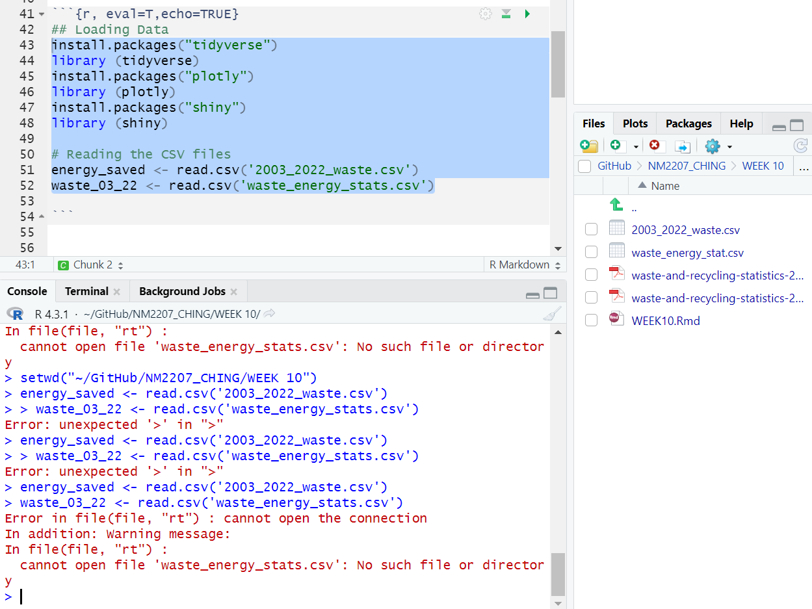
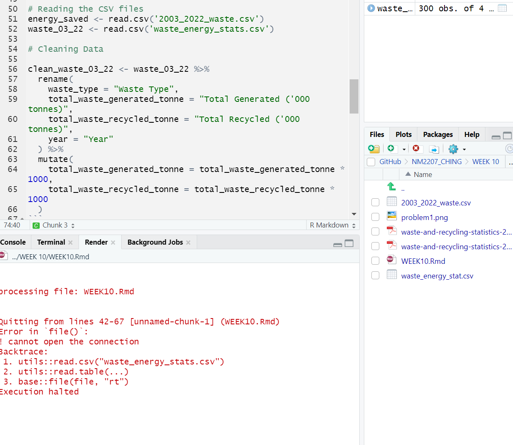
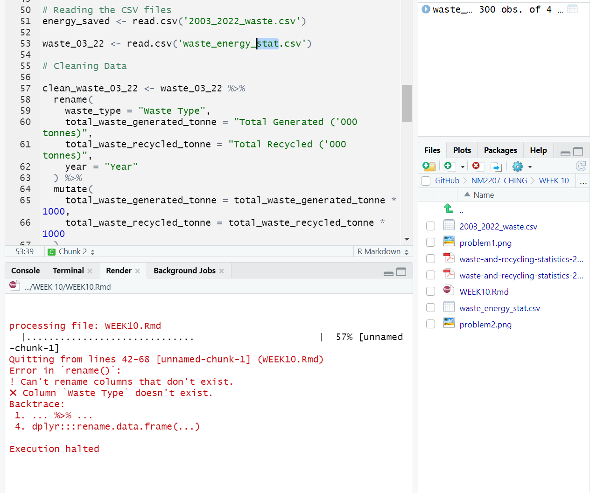
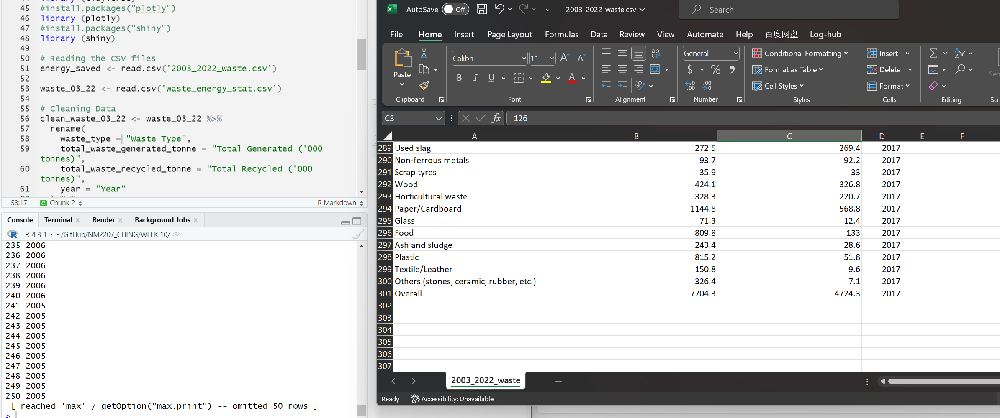

```{r setup, include=FALSE}
knitr::opts_chunk$set(echo = TRUE)
```


Week 9 

    (1) What is the topic that you have finalized? (Answer in 1 or 2 sentences)
        Food Waste Data Analysis
    
    (2) What are the data sources that you have curated so far? (Answer 1 or 2 sentences).
        Recycling statistics per type of waste for 2018-2022
        Source: https://www.nea.gov.sg/our-services/waste-management/waste-statistics-and-overall-recycling
        
        
(Continuation) Week 10

    (1) What is the question that you are going to answer? (Answer: One sentence that ends with a question mark that could act like the title of your data story)
    
Learn how much Singapore is saving energy per years by recycling plastics, paper, glass, ferrous and non-ferrous metal.
    
    (2) Why is this an important question? (Answer: 3 sentences, each of which has some evidence, e.g., “According to the United Nations...” to justify why the question you have chosen is important)
        
In Singapore's quest to achieve zero-waste status, the looming challenge of increased waste disposal.

Coupled with Semakau Landfill's impending limit by 2035, necessitates urgent action. 

The city-state, facing a shortage of land for waste facilities, responds with a unique strategy—inspiring citizens through the revelation of yearly energy savings from collective recycling efforts.
        
    (3) Which rows and columns of the dataset will be used to answer this question? (Answer: Actual names of the variables in the dataset that you plan to use).

I will be using Recycling statistics to calculate energy saved every year from 2003 to 2022 based on 6 waste types: plastics, paper, glass, ferrous, non-ferrous metal and food.

```{r, eval=T,echo=TRUE}
## Loading Data
#install.packages("tidyverse")
library (tidyverse)
#install.packages("plotly")
library (plotly)
#install.packages("shiny")
library (shiny)

# Reading the CSV files
waste_03_22 <- read.csv('2003_2022_waste.csv')


energy_saved <- read.csv('waste_energy_stat.csv')


# Renaming columns and mutating the data to convert values from kilotonnes to tonnes
clean_waste_03_22 <- waste_03_22 %>%
  rename(
    waste_type = "waste_type",
    total_waste_generated_tonne = "total_generate_1k_tonnes",
    total_waste_recycled_tonne = "total_recycled_1k_tonnes",
    year = "year"
  ) %>%
  mutate(
    total_waste_generated_tonne = total_waste_generated_tonne * 1000,
    total_waste_recycled_tonne = total_waste_recycled_tonne * 1000
  )


# Filtering waste_03_22 dataset for specific years and waste types
wasteselected <- clean_waste_03_22 %>%
  filter(year %in% 2003:2022,
         waste_type %in% c("Plastics", "Ferrous Metals", "Non-Ferrous Metals", "Glass", "Food"))%>%
  arrange(waste_type)

---
          #problem: missing data for Food and Non-Ferrous Metals
---
  
### Calculating and adding recycling rate into DataFrame for analysis.

# Calculate recycling_rate and round to 2 decimal places
clean_waste_03_22$recycling_rate <- round(
  clean_waste_03_22$total_waste_recycled_tonne / clean_waste_03_22$total_waste_generated_tonne,
  2
)

# Display the cleaned data
clean_waste_03_22

---
   #managed to work 
---

# Filter overall waste types
overall <- data %>%
  filter(waste_type %in% c("Overall", "Total"))

# Create a bar plot for Waste Generated and Waste Recycled
fig <- plot_ly() %>%
  add_trace(
    type = "bar",
    x = ~overall$year,
    y = ~overall$total_waste_generated_tonne,
    name = "Waste Generated"
  ) %>%
  add_trace(
    type = "bar",
    x = ~overall$year,
    y = ~overall$total_waste_recycled_tonne,
    name = "Waste Recycled"
  )

fig
```
###Analysis from the bar chart
There has been a steady increasing in recycling effort as we see an increase in waste generated. However we can see that 2018 to 2020 there is a dip in recycling effort and waste generated. It could be because of the covid-19 situation. We are unable to tell whether the bar graph tells us an increase or decrease in recycling effort therefore we will generate a graph using the recycling rate. 

```{r, eval=T,echo=TRUE}
# Clean the waste_type column
data$waste_type <- gsub("Non-ferrous metal|Non-ferrous metals", "Non-Ferrous Metal", data$waste_type)
data$waste_type <- gsub("Plastics", "Plastic", data$waste_type)
data$waste_type <- gsub("Ferrous metal", "Ferrous Metal", data$waste_type)
data$waste_type <- gsub("Paper/Cardboard", "Paper", data$waste_type)

# Merge data with clean_energy_saved
total_data <- merge(data, clean_energy_saved, by.x = "waste_type", by.y = "material", all.x = TRUE, all.y = FALSE)

# Clean energy_saved column
total_data$energy_saved <- as.numeric(gsub("kWh", "", total_data$energy_saved, fixed = TRUE))
total_data$energy_saved <- round(total_data$energy_saved)

# Calculate total_energy_saved
total_data$total_energy_saved <- total_data$total_waste_recycled_tonne * total_data$energy_saved

# Box plot of total_waste_recycled_tonne
fig <- plot_ly(total_data, x = ~year, y = ~total_waste_recycled_tonne, type = "box")
fig <- fig %>% layout(title = "Box Plot of Total Waste Recycled Tonne", yaxis = list(title = "Total Waste Recycled Tonne"))

fig

# Box plot of total_energy_saved
fig <- plot_ly(total_data, x = ~year, y = ~total_energy_saved, type = "box")
fig <- fig %>% layout(title = "Box Plot of Total Energy Saved", yaxis = list(title = "Total Energy Saved"))

fig

# Multilevel scatter plot
fig <- plot_ly(total_data, x = ~year, y = ~total_energy_saved, size = ~total_waste_recycled_tonne, color = ~waste_type,
               sizes = c(10, 60), marker = list(opacity = 0.5, line = list(width = 0.5, color = 'white')))
fig <- fig %>% layout(title = "Multilevel Scatter Plot of Total Energy Saved",
                      xaxis = list(title = "Year"),
                      yaxis = list(title = "Total Energy Saved"))

fig

# Energy saved per year
annual_energy_savings <- total_data %>%
  group_by(year) %>%
  summarize(total_energy_saved = sum(total_energy_saved))

# Convert total_energy_saved to GWh
annual_energy_savings$total_energy_saved <- round(annual_energy_savings$total_energy_saved / 1000000, 2)

# Display the result
tail(annual_energy_savings)


```
##Seasonal Patterns:

    Hypothesis: There might be seasonal variations in waste generation and recycling, impacting energy savings.
    Question: Do certain waste types exhibit seasonal patterns in energy savings?
    
    Include the challenges and errors that you faced and how you overcame them.
    
##Comparison Across Materials:

    Hypothesis: Different materials (plastics, metals, glass) may exhibit distinct patterns in energy savings and recycling rates.
    Question: How do energy savings and recycling rates compare among different materials?
    
##Efficiency of Recycling Processes:

    Hypothesis: Certain waste types may have a higher recycling efficiency, leading to more energy savings per tonne recycled.
    Question: How does the energy saved per tonne vary across different waste types?

##Impact of Recycling Initiatives:

    Hypothesis: Over the years, increased recycling initiatives may have positively impacted energy savings.
    Question: Is there a noticeable trend in energy savings per waste type over the years?
    
#Problem Encounter 1
```{r}

```

Overcome: by typing separate lines instead of just throwing both at the same time.

#Problem Encounter 2
```{r}

```
Overcome: by typing "waste_energy_stat.csv" instead of "waste_energy_stat(s).csv" --> careless typing

#Problem Encounter 3
```{r}

```
Overcome: Confirm column names mentioned in the 'rename' and 'mutate' function exist in the CSV. They are also case-sensitive, so make sure there are no typos.

#Problem Encounter 4
```{r}

```
Overcome: Rearrange the data?


Overview of the Introduction of the webpage:
Learn how much Singapore is saving energy per years by recycling plastics, paper, glass, ferrous and non-ferrous metal.

## Introduction of Narrative 

In the vibrant landscape of Singapore, a groundbreaking goal is set to transform the nation into a zero-waste haven. However, a shadow looms over this aspiration as the government grapples with a surge in waste disposal over the past four decades. The alarm bells ring louder with the realization that Semakau Landfill, the primary waste destination, could reach its limit by 2035. Singaporeans are urged to confront this pressing issue, detailed in the (https://www.towardszerowaste.gov.sg/zero-waste-masterplan/#:~:text=The amount of waste disposed,plants or landfills in Singapore.).

Adding to the challenge, the city-state faces a shortage of land to construct new waste management facilities, amplifying the urgency of the situation. A unique strategy emerges to inspire citizens through the revelation of the energy saved annually through combined recycling efforts.

Embarking on a transformative journey, a project unfolds—data cleansing and preparation for analysis. The Singapore NEA Energy Savings dataset takes center stage, providing insights into total garbage collection and recycling rates. The diversity in material names, gathered from various sources, adds a layer of complexity.

To weave in the latest developments, the narrative integrates the 2022 data from waste statistics and overall recycling directly from the National Environment Agency's website (https://www.nea.gov.sg/our-services/waste-management/waste-statistics-and-overall-recycling). This inclusion ensures a comprehensive and up-to-date statistical analysis.

The quest for understanding extends further, exploring the key information from Greentumble (https://greentumble.com/how-does-recycling-save-energy/) to gauge the potential energy production from recycling efforts. The focus narrows to five waste types—plastics, paper, glass, ferrous, and non-ferrous metals—as the cornerstone for calculating energy saved annually from 2003 to 2022 in hope to propel Singapore towards a future where waste is not a problem but a source of renewed energy.

