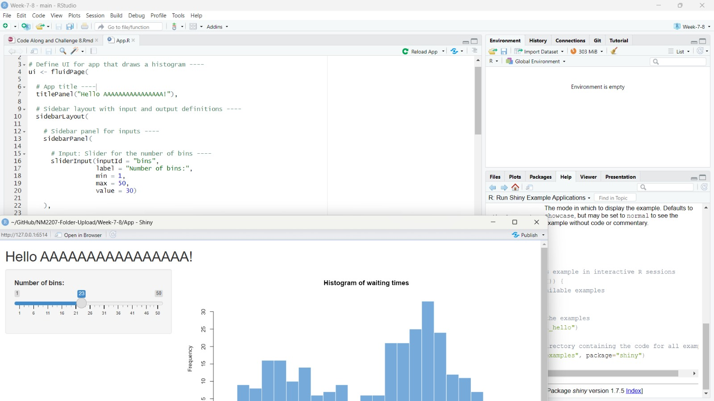
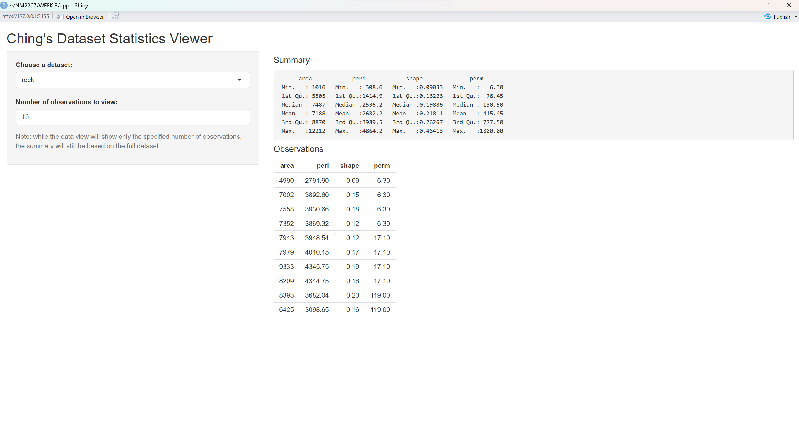

```{r setup, include=FALSE}
knitr::opts_chunk$set(echo = TRUE)
```

```{r, out.height= "350px",out.width= "800px",echo=TRUE,eval=T,fig.cap="WEEK8 CODE"}
 
```
```{r, out.height= "350px",out.width= "800px",echo=TRUE,eval=T,fig.cap="WEEK8 CODE"}
 

##
# This is a Shiny web application. You can run the application by clicking
# the 'Run App' button above.
#
# Find out more about building applications with Shiny here:
#
#    http://shiny.rstudio.com/
#

library(shiny)

# Assuming you have a dataset named 'your_dataset' (replace with your actual dataset)
your_dataset <- mtcars

# Define UI for dataset viewer app ----
ui <- fluidPage(
  
  # App title ----
  titlePanel("Ching's Enhanced Dataset Viewer"),
  
  # Sidebar layout with input and output definitions ----
  sidebarLayout(
    
    # Sidebar panel for inputs ----
    sidebarPanel(
      
      # Input: Select a dataset ----
      selectInput("dataset", "Choose a dataset:",
                  choices = c("Your Dataset", "Another Dataset", "Yet Another Dataset")),
      
      # Input: Specify the number of observations to view ----
      numericInput("obs", "Number of observations to view:", 10),
      
      # Include clarifying text ----
      helpText("Note: The data view will show the specified",
               "number of observations, and the summary will be based",
               "on the full dataset.")
    ),
    
    # Main panel for displaying outputs ----
    mainPanel(
      
      # Output: Header + summary of distribution ----
      h4("Summary"),
      verbatimTextOutput("summary"),
      
      # Output: Plot to visualize the dataset ----
      plotOutput("plot"),
      
      # Output: Header + table of distribution ----
      h4("Top Observations"),
      tableOutput("view")
    )
  )
)

# Define server logic to summarize and view selected dataset ----
server <- function(input, output) {
  
  # Reactive function to get the selected dataset
  datasetInput <- reactive({
    switch(input$dataset,
           "Your Dataset" = your_dataset,
           "Another Dataset" = mtcars,
           "Yet Another Dataset" = iris)
  })
  
  # Generate a summary of the dataset ----
  output$summary <- renderPrint({
    dataset <- datasetInput()
    summary(dataset)
  })
  
  # Plot to visualize the dataset ----
  output$plot <- renderPlot({
    dataset <- datasetInput()
    hist(dataset$mpg, main = "Histogram of MPG", xlab = "MPG")
  })
  
  # Show the top "n" observations ----
  output$view <- renderTable({
    head(datasetInput(), n = input$obs)
  })
}

# Create Shiny app ----
shinyApp(ui, server)


```

